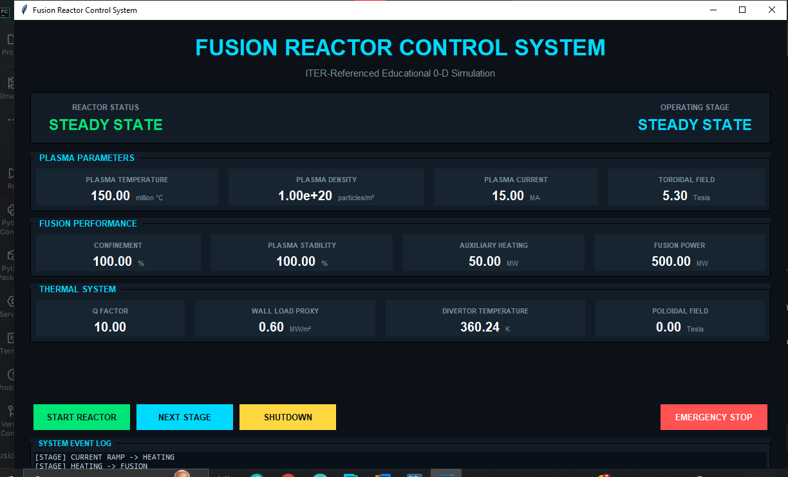

# Fusion Reactor Simulator

This is a Python project I built to learn more about fusion reactors, plasma physics, and how simulation software can be structured.

The project is inspired by publicly available ITER reference parameters and represents a fusion reactor using a simplified 0-D model.

I built the project with AI assistance, while I handled the overall structure, testing, integration, and development direction. I'm also using this project to learn more about the physics behind fusion and tokamaks.

> Note: This is an educational simulator. It is not a real ITER control system or an accurate engineering simulation of a fusion reactor.

## What does it do?

The simulator represents a simplified fusion reactor going through different operating stages:

OFF
|
VACUUM
|
MAGNET CHARGE
|
PLASMA INIT
|
CURRENT RAMP
|
HEATING
|
FUSION
|
STEADY STATE

As the reactor moves through these stages, the simulator updates different plasma and reactor parameters.

Some of the things it tracks are:

- Plasma temperature
- Plasma density
- Plasma current
- Toroidal magnetic field
- Plasma confinement
- Plasma stability
- Heating power
- Fusion power
- Q factor
- Divertor temperature
- Wall-load indicator

## The GUI

The project has a Tkinter-based control-room interface.

It provides a simple way to start the reactor, move through the different stages, monitor the simulated plasma, and shut the reactor down.

The main controls are:

- START REACTOR
- NEXT STAGE
- SHUTDOWN
- EMERGENCY STOP

## ITER Reference Values

I used some published ITER parameters as reference points for the simulator.

| Parameter | Reference |
|---|---:|
| Major Radius | 6.2 m |
| Minor Radius | 2.0 m |
| Plasma Volume | approximately 830 m3 |
| Toroidal Field | 5.3 T |
| Maximum Plasma Current | 15 MA |
| Reference Heating Power | 50 MW |
| Target Fusion Power | 500 MW |
| Target Q | 10 |
| Target Temperature | approximately 150 million C |

These numbers are used as reference targets inside the simulation. They are not intended to represent live ITER operating data.

## How the Physics Works

The physics in this project is intentionally simplified.

Instead of trying to reproduce the full physics of a tokamak, the simulator uses relationships between a few important parameters.

For example:

Heating and Magnetic Confinement
|
Plasma Conditions
|
Fusion Estimate
|
Fusion Power
|
Q Factor

The current version does not simulate detailed plasma transport, turbulence, MHD behaviour, neutron transport, or the actual ITER control system.

Those are areas I would like to learn more about and potentially improve in future versions.

## Project Files

FusionReactorSimulator/
|
├── control_system.py
├── fusion_core.py
├── gui.py
├── main.py
├── plasma_physics.py
├── reactor_config.py
└── README.md

### reactor_config.py

Contains the reference parameters used by the simulator.

### fusion_core.py

Contains the main reactor state and basic reactor operations.

### plasma_physics.py

Contains the simplified plasma calculations.

### control_system.py

Handles the reactor startup sequence, operating stages, and shutdown procedures.

### gui.py

Contains the graphical interface built with Tkinter.

### main.py

Runs the console version of the simulator.

## Running It

You'll need:

- Python 3.x
- Tkinter

On most Windows Python installations, Tkinter is already included.

### GUI

python gui.py

### Console Version

python main.py

## AI Assistance

I used AI heavily while developing this project, especially for generating and refining parts of the code.

I was responsible for deciding what I wanted the project to do, putting the different parts together, testing the program, checking and fixing problems, and directing the overall development.

I'm also using this project as a way to learn the underlying concepts rather than claiming that I already understand all of ITER or fusion engineering.

## What I'm Learning From This

This project is helping me learn about:

- Python
- Object-oriented programming
- Tkinter
- Modular programming
- Simulation design
- State-based control systems
- Plasma physics
- Fusion energy
- Tokamaks
- ITER

I'm learning the physics alongside the development of the simulator.

## Future Plans

There are several things I'd like to improve later, including:

- Better plasma physics models
- Time-dependent plasma behaviour
- More realistic fusion calculations
- Graphs and real-time data
- Plasma diagnostics
- Fault and alarm systems
- Better thermal modelling
- More detailed reactor controls
- Data logging

## Disclaimer

This project is for educational purposes.

It should not be used as an engineering model, reactor-control system, or representation of the actual ITER control software.

The physics and reactor behaviour are simplified so that I can experiment with the concepts while learning.

## Current Status

The simulator currently has:

- A working Python backend
- A simplified plasma-physics model
- A reactor startup and shutdown sequence
- A Tkinter control-room GUI
- ITER-referenced configuration values

The project is still a work in progress, and I plan to keep improving both the software and my understanding of the physics behind it.
